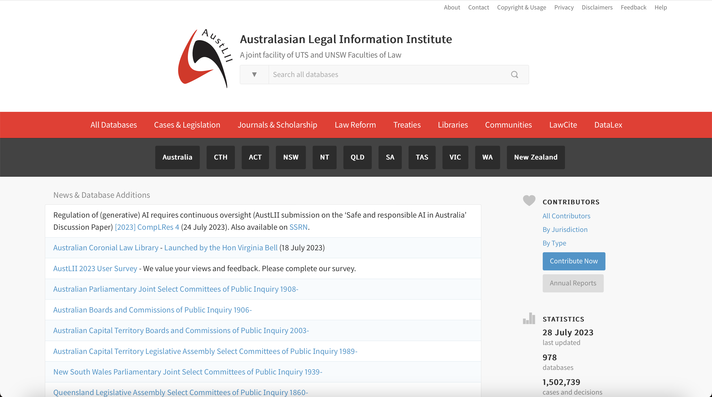

type:: [[awesome tools]]
alias:: [[AustLII]]
source:: [[University of Technology Sydney]], [[University of New South Wales]]
topic:: [[research tools]]
related:: [[New Zealand Legal Information Institute]]
url:: [link](https://www.austlii.edu.au)

	- The open legal database by the Australasian Legal Information Institute ([[AustLII]]) refers to a comprehensive online platform that provides free access to a vast collection of legal materials and resources. It is an initiative aimed at enhancing public access to legal information, promoting transparency, and supporting the understanding of laws in [[Australia]], [[New Zealand]] and other regions. The database encompasses statutes, regulations, case law, treaties, and various other legal documents from numerous jurisdictional sources. [[AustLII]]'s open legal database serves as a valuable resource for legal professionals, researchers, students, and the general public, facilitating the exploration, research, and analysis of legal information for educational, professional, and judicial purposes.
	- 