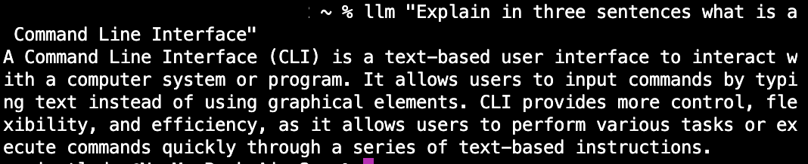

type:: [[awesome tools]]
author:: [[Simon Wilson]]
category:: [[GitHub Repo]]
topic:: [[CLI tools]], [[AI]] 
url:: [link](https://github.com/simonw/llm)

	- A Command-Line Interface (CLI) and a Python library enabling users to interact with various [[LLMs]], such as [[OpenAI]], [[PaLM]], and locally installed models on their machines. Available plugins include LL-GPT models released by the [[GPT4All]] project, Google's PaLM 2 model, remote models hosted on Replicate, Claude and Claude Instant models, MPT-30B local model, and a simple Markov chain model. Each addition has its own GitHub repository and offers unique capabilities for generating text.
	- 