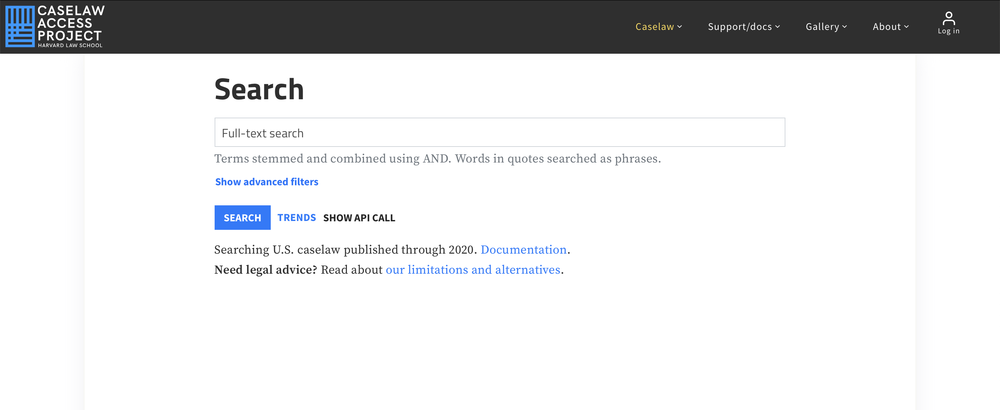

type:: [[awesome tools]]
source:: [[Harvard Law School]]
category:: #database 
topic:: [[research tools]]
url:: [link](https://case.law/about/)

	- [[Caselaw Access Project]] aims to provide free access to legal information and case law. It aggregates data from various sources, including court websites and legal document repositories, to create a comprehensive and searchable database. The platform also offers features such as full-text search, citation analysis, and visualisations to facilitate legal research and analysis.
	- 